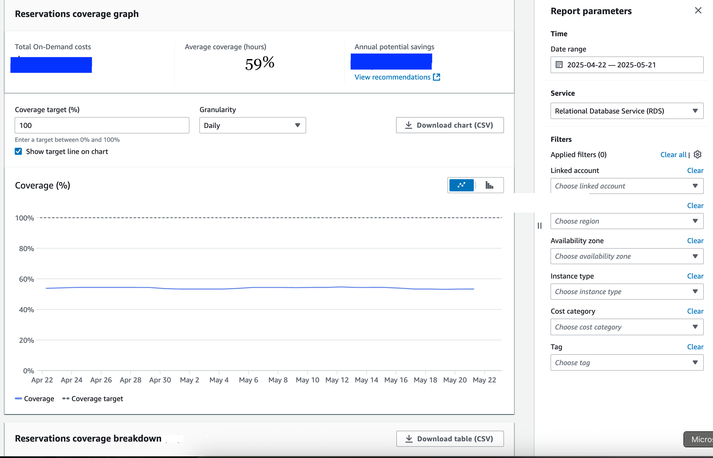
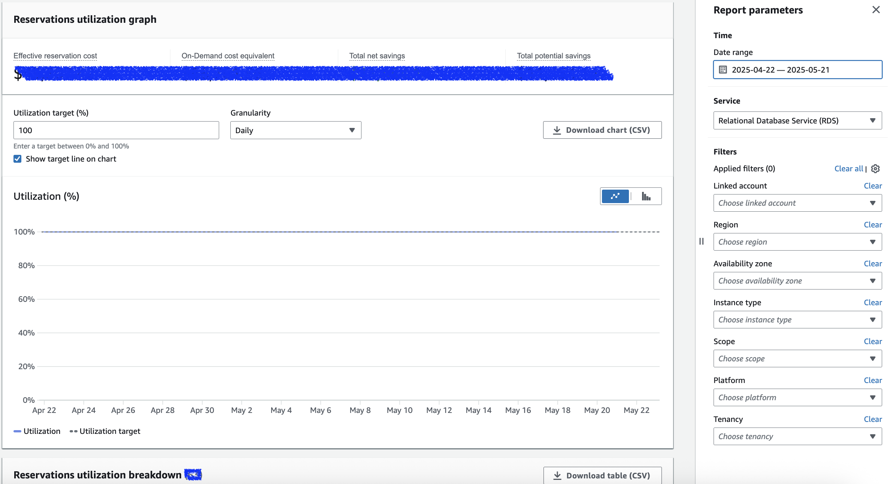
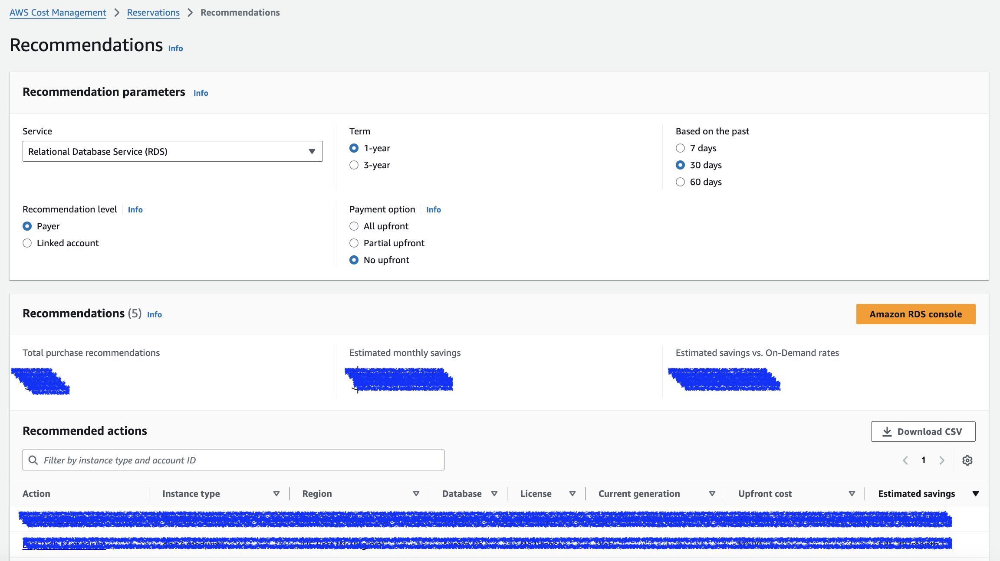

# Amazon Reserved Instance Coverage Analytics

> **⚠️ DISCLAIMER**: This tool provides analysis and recommendations for AWS Reserved Instance (RI) purchases. While we strive for accuracy, users should carefully verify all recommendations before making any RI purchase decisions. You are responsible for your own RI purchase decisions and their financial implications. Always review AWS documentation and consult with your finance team before making RI commitments.

A command-line tool for analyzing AWS Reserved Instance (RI) coverage based on AWS Cost Explorer reports.

> At the moment, only RDS Reserved Instances analysis is supported.

## Overview

This CLI tool helps AWS users analyze their Reserved Instance (RI) coverage for various AWS services like RDS and EC2. It processes CSV reports from AWS Cost Explorer and provides detailed insights into RI coverage and cost metrics across different regions and instance types.

## Installation

### Prerequisites

1. Install Python 3.11 or later
2. Install `uv` - a fast Python package installer and resolver: ([more details](https://docs.astral.sh/uv/getting-started/installation/))

```bash
curl -LsSf https://astral.sh/uv/install.sh | sh
```

3. Get Reserved Instances reports from AWS Cost Exporler

> It's easy to access your [RI reports in Cost Explorer](https://docs.aws.amazon.com/cost-management/latest/userguide/ce-ris.html), and we shall focus on the recent 30 days data for analysis. 

There are 3 reports we may select and download so as to prepare RIs analysis, and they are

  - RIs Coverage Report ([more details](https://docs.aws.amazon.com/cost-management/latest/userguide/ce-default-reports.html#ce-coverage-views)) - The coverage report shows how many of your resources (e.g. RDS, EC2) **instance hours** are covered by RIs. 

    > **instance hours** does not tell your cost coverage as your instances may have a variety of sizes.

    **To download the report**

    

    * Please ensure to select:
        * Date Range with the recent 30 days
        * Service: RDS
    * Once the report is generated, please click 'Download table (CSV)' button, then, rename it as 'ri-rds-coverage-report.csv'.

  - RIs utilization report ([more details](https://docs.aws.amazon.com/cost-management/latest/userguide/ce-default-reports.html#ce-utilization-views)) - The utilization report shows how your RIs being utilized, and list the related cost savings, and On-demand cost equevalent. Again, when select the report, please ensure to set recent 30 days. 

    On the other hand, when the report doesn't exist, it indicates that you don't have RIs.

    **To download the report**

    

    * Please ensure to select:
        * Date Range with the recent 30 days (Same as 'coverage report')
        * Service: RDS
    * Once the report is generated, please click 'Download table (CSV)' button, then, rename it as 'ri-rds-utilization-report.csv'.

  - RIs recommendations report ([more details](https://docs.aws.amazon.com/cost-management/latest/userguide/ri-recommendations.html)) - The recommendations report shows cost savings opportunity with purchasing RIs for 12month or 36month terms. Especially, please choose 'Past 30 days' for the usage analysis.

    

    * Please ensure to select:
        * Service: RDS
        * Term: 1 year
        * Recommendation level: Payer
        * Payment option: No upfront
        * Base on the past: 30 days
    * Once the report is generated, please click 'Download table (CSV)' button, then, rename it as 'ri-rds-recommendations-report.csv'.


### Project Setup

1. Clone this repository:
```bash
git clone <repository-url>
cd reserved-instance-coverage-analytics
```

2. Sync and create virtual environment.
```bash
uv sync
```

3. Prepare the Reserved Instance reports:

## CLI Commands

The tool provides three main commands:

> In command `analyze-target-coverage`, we should use *RIs Coverage Report*; in command `analyze-cost-coverage`, we should use *RIs Utilization Report* and *RIs Recommendations report*. (there may be possible that either of the reports may be missing, and you can just provide one of them.)

### 1. analyze-target-coverage

Analyzes RI coverage from per existing coverage report and provide guidance on what RIs purchase changes are needed for meeting **target coverage**.


```bash
uv run main ri-coverage-analytics analyze-target-coverage \
    ./samples/rds-ri-coverage-past-30days.csv \
    --start-date 2025-01-01 \
    --end-date 2025-01-31 \
    --target-coverage 85.0 \
    --ri-service-type RDS
```

Parameters:

- `csv_path`: Path to the CSV file with instance data (required)
- `--start-date`: Start date in YYYY-MM-DD format (required)
- `--end-date`: End date in YYYY-MM-DD format (required)
- `--target-coverage`: Target coverage percentage (default: 80%)
- `--ri-service-type`: Type of Reserved Instance to analyze (default: RDS)

### 2. analyze-cost-coverage

Analyzes RI coverage from a cost perspective using AWS Cost Explorer reports.

```bash
# Analyze RDS RIs with custom period
uv run main analyze-cost-coverage  --utilization-report ./samples/rds-ri-utilization-past-30days.csv --recommendations-report ./samples/rds-ri-recommendations-past-30days.csv --days 30
```

Parameters:

- `--recommendations-report`: Path to the RI recommendations report CSV (optional)
- `--utilization-report`: Path to the RI utilization report CSV (optional)
- `--days`: Number of days for the utilization report (default: 30)
- `--ri-service-type`: Type of Reserved Instance to analyze (default: RDS)


### 3. ref-doc-transform

> For RI coverage analytics, you don't need this commands. It's for downloading webpage, converting to markdown, and use it during ***ai coding*** when we need some reference from dev guide. 
Downloads and converts AWS documentation to markdown format for offline reference. 

```bash
ri-coverage-analytics ref-doc-transform \
    https://aws.amazon.com/rds/reserved-instances/ \
    docs/rds_ri_reference.md
```

Parameters:

- `web_page_uri`: URL of the web page to transform (required)
- `local_file`: Path to save the markdown file (required)

## Output Reports

The tool generates comprehensive reports in the following structure:

```
reports/
├── ri-cost-coverage-report-YYYY-MM-DD/
│   ├── ri-cost-coverage-report.html
│   ├── overall_coverage_*.png
│   ├── region_coverage_*.png
│   └── engine_coverage_*.png
└── ri-target-coverage-report-YYYY-MM-DD/
    └── ri-target-coverage-report.html
```

Each report includes:

- Overall RI coverage with cost breakdown
- Per-region coverage percentages and costs
- Per-engine/instance-type coverage and costs
- Visual charts and graphs
- Recommendations for achieving target coverage

## Technical Details

### Report Generation

- HTML reports with charts
- Console output with rich formatting
- Detailed recommendations based on target coverage
- Cost analysis with formatted currency values

### Core Components

1. **Data Processing**:
   - Parses CSV data using pandas
   - Calculates derived metrics like estimated instance amounts and normalized instance sizes
   - Maps region names to AWS region codes

2. **Instance Size Normalization**:
   - Converts instance classes to base instance size (e.g., db.r5.large) and size factor
   - Handles different instance families and sizes appropriately

3. **Coverage Analysis**:
   - Creates pivot tables by region, database engine, and instance size
   - Calculates coverage percentages and identifies gaps
   - Generates recommendations for achieving target coverage

4. **Output Generation**:
   - Console output with rich formatting
   - Markdown reports for documentation
   - HTML reports with interactive styling

5. **Web Document Transformation**:
   - Uses Selenium for rendering dynamic web pages
   - Extracts content using BeautifulSoup
   - Converts HTML to markdown format

### Key Technologies

- **Python 3.11+**: Core programming language
- **Typer**: CLI interface framework
- **Pandas**: Data processing and analysis
- **Rich**: Terminal formatting and display
- **Selenium**: Web page rendering for documentation transformation
- **BeautifulSoup**: HTML parsing
- **html2text**: HTML to markdown conversion

## Code Review Summary

The codebase is well-structured with clear separation of concerns:

- **main.py**: Contains the CLI commands and high-level workflow
- **utils.py**: Provides utility functions for calculations and data transformations
- **output_format.py**: Handles different output formats (console, HTML)
- **coverage_result.py**: PyDantic class to store coverage analysis result.
- **coverage_report.py**: Handles coverage generation (HTML)
- **reference_doc_transformer.py**: Manages web page transformation to markdown

The implementation follows best practices with comprehensive error handling, clear documentation, and modular design. The code is extensible for future enhancements such as additional output formats or more sophisticated analysis techniques.

## License

MIT License

## Contributing

Contributions are welcome! Please feel free to submit a Pull Request.
